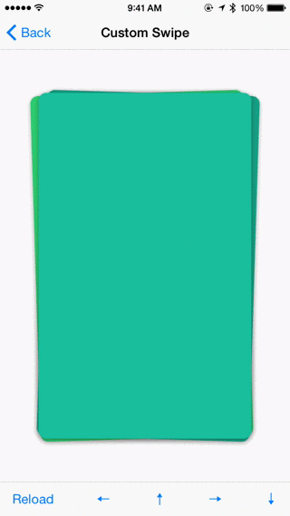
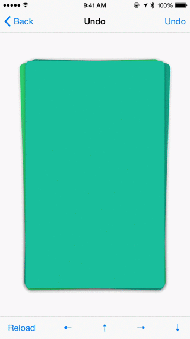

# ZLSwipeableViewSwift
A simple view for building card like interface like [Tinder](http://www.gotinder.com/) and [Potluck](https://www.potluck.it/). ZLSwipeableViewSwift is based on [ZLSwipeableView](https://github.com/zhxnlai/ZLSwipeableView/).

Preview
---
### Custom Animation

### Custom Swipe

### Custom Direction

### Undo

CocoaPods
---
<!-- You can install `ZLSwipeableView` through CocoaPods adding the following to your Podfile:

    pod 'ZLSwipeableView' -->

Usage
---
Check out the [demo app](https://github.com/zhxnlai/ZLSwipeableViewSwift/archive/master.zip) for an example. It contains the following demos: Default, Custom Animation, Custom Swipe, Custom Direction and Undo.

`ZLSwipeableView` can be added to storyboard or instantiated programmatically:
~~~swift
var swipeableView = ZLSwipeableView(frame: CGRect(x: 0, y: 0, width: 300, height: 500)))
view.addSubview(swipeableView)
~~~

The `nextView` property, a closure that returns an `UIView`, is used to provide subviews to `ZLSwipeableView`. After defining it, you can call `loadViews` and `ZLSwipeableView` will invoke `nextView` `numPrefetchedViews` times and animate the prefetched views.
~~~swift
swipeableView.nextView = {
  return UIView()
}
swipeableView.numPrefetchedViews = 3
swipeableView.loadViews()
~~~

The demo app includes examples of both creating views programmatically and loading views from Xib files that [use Auto Layout](https://github.com/zhxnlai/ZLSwipeableView/issues/9).

To discard all views and reload programmatically:
~~~swift
swipeableView.discardViews()
swipeableView.loadViews()
~~~

You can limit the direction swiping happens using the `direction` property and register callbacks like this. Take a look at the [Custom Direction](#custom-direction) example for details.
~~~swift
swipeableView.direction = .Left | .Up
swipeableView.direction = .All

swipeableView.didStart = {view, location in
    println("Did start swiping view at location: \(location)")
}
swipeableView.swiping = {view, location, translation in
    println("Swiping at view location: \(location) translation: \(translation)")
}
swipeableView.didEnd = {view, location in
    println("Did end swiping view at location: \(location)")
}
swipeableView.didSwipe = {view, direction in
    println("Did swipe view in direction: \(direction)")
}
swipeableView.didCancel = {view in
    println("Did cancel swiping view")
}
~~~

You can swipe the top view programmatically in one of the predefined directions or with any point and direction in the view's coordinate.
~~~swift
swipeableView.swipeTopView(inDirection: .Left)
swipeableView.swipeTopView(inDirection: .Up)
swipeableView.swipeTopView(inDirection: .Right)
swipeableView.swipeTopView(inDirection: .Down)

swipeableView.swipeTopView(fromPoint: CGPoint(x: 100, y: 30), inDirection: CGVector(dx: 100, dy: -800))
~~~
You can also change how the direction gets interpreted by overriding the `interpretDirection` property. Take a look at the [Custom Swipe](#custom-swipe) example for details.

You can create custom animation by overriding the `animateView` property. Take a look at the [Custom Animation](#custom-animation) example for details.

You can undo/rewind by storing the swiped views and insert them back to the top by calling `insertTopView`. Take a look at the [Undo](#undo) example for details.

Requirements
---
- iOS 7 or higher.

Credits
---
Big thanks to the [contributors](https://github.com/zhxnlai/ZLSwipeableView/graphs/contributors) of ZLSwipeableView.

License
---
ZLSwipeableViewSwift is available under MIT license. See the LICENSE file for more info.
